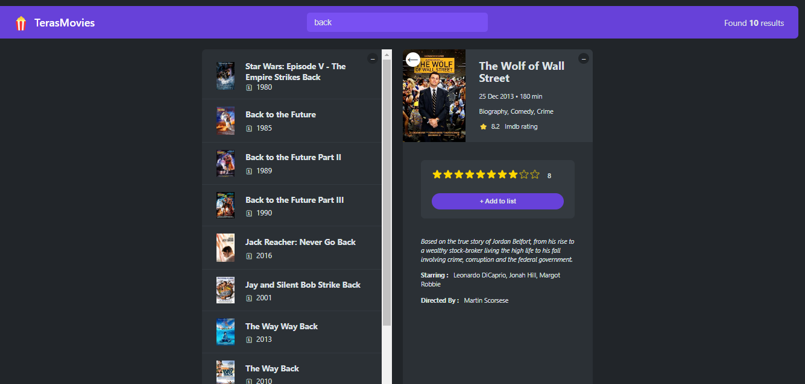

# TerasMovie

This is a React app that allows users to search for movies, view movie details, rate movies, and keep track of their favorite movies.

<h2 align = "center">
      
</h2>

## Features

- Search for movies by title 
- View movie details including poster, release date, runtime, genre, ratings, plot, actors, and director
- Rate movies with a star rating
- Add movies to a favorites list
- View favorite movies list with average ratings and runtime
- Remove movies from favorites
- Persist favorite movies in localStorage

## Technologies Used

- React
- React Hooks (useState, useEffect, useRef) 
- React Components
- React Composition
- Custom Hook (useMovie)
- OMDB API
- Local Storage

## Component Structure

- **App** - Stateful component, handles all state & data fetching
- **NavBar** - Displays heading & searchbar
- **Search** - Search input that updates query state
- **Main** - Wraps MovieList and MovieDetails sections
- **List** - Wraps all list components, handles open/closed toggle
- **Button** - Toggle button for opening/closing List components  
- **MovieList** - Displays movie search results 
- **MovieDetails** - Displays details on clicked movie
- **MovieSummary** - Summary stats for watched movies
- **MoviesWatched** - Display individual watched movie row
- **Loader** - Loading spinner component
- **Error** - Displays error message

## Custom Hooks

- **useMovie** - Handles fetching movie data from OMDB API

## Installation

1. Clone the repo
```
git clone https://github.com/hariyebk/TerasMovies.git
```

2. Install dependencies
```
npm install
```

3. Start the dev server
```
npm start
```

4. Open http://localhost:3000 to view the app

## License

MIT License
